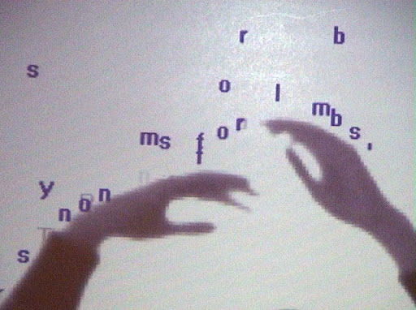
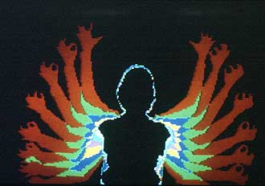

# ReUtterback

## MIT Media Lab - Recreating the Past - Class 8: Camille Utterback & Myron Krueger

The MIT Media Lab class - Recreating the Past - explores a number of influential artists who have, over the past century, added their own unique perspective on computational art. Each week focuses on a new artist and through exploring their view point and recreating their artworks I hope to gain a valuable window into their thought processes, helping me learn how to express my own opinions through computational art. 

## Camille Utterback/Myron Krueger

For this week I drew inspiration from both artists in equal measure. I wanted the silhouette feel that Myron leveraged in his work - projecting the body into the artwork as a tangible yet abstract object and also the interactivity found within something like Camille's Text Rain where the participant can push, move and engage with the piece. 

Due to the past weeks, in COVID19 lockdown, feeling very gloomy and grey I wanted this piece to be the total opposite, a place which is bold and bright and colorful and engages the participant to just enjoy the space. I immediately though of a ball pit, a throwback to youth and a sense of being carefree.  

In the end I implemented two distinct versions - one where the "balls" were pushed away from your body (as they would be in a physical ballpit) but also one where they would be attracted and kept inside of your body. This second system made for some interesting interactions as the particles could be "caught" and "released" based on your motion.

## Text Rain/Experiments in AR

Original - Text Rain            |  Original - Experiments in AR
:-------------------------:|:-------------------------:
 |   

#### Recreation

  

#### Process

There are two main technical elements to this piece - they physics system of the particles and the body mapping via the camera input. The two process gifs below highlight how the body tracking operates. The camera feed would perform background subtraction and thresholding in order to detect the position of the participant (this worked best for myself using a dark background and light clothing).

After the silhouette was captures then the particles needed to be able to interact with it. This was done by looking up the current pixel in from the thresholded camera feed at each ball's position and checking whether it was black or white.

If the underlying pixel was black - the ball will keep moving in the randomized direction it was initialized to. If the background changes to white then the direction is reversed - implementing the bouncing effect. The main difficulty with this metholodogy was what happens when the motion in the frame moves too quickly for the balls to bounce, they can become encaptured by white pixels and hence get stuck.

If a ball encounters two white pixels in a row, instead of just repeatedly reversing direction - it will rapidly accelerate in it's original direction until it hits a black pixel. This is the essence of the physics system and is what creates the flurry of particle motion as I walk and move through the scene and adds a sense of life to the piece.

